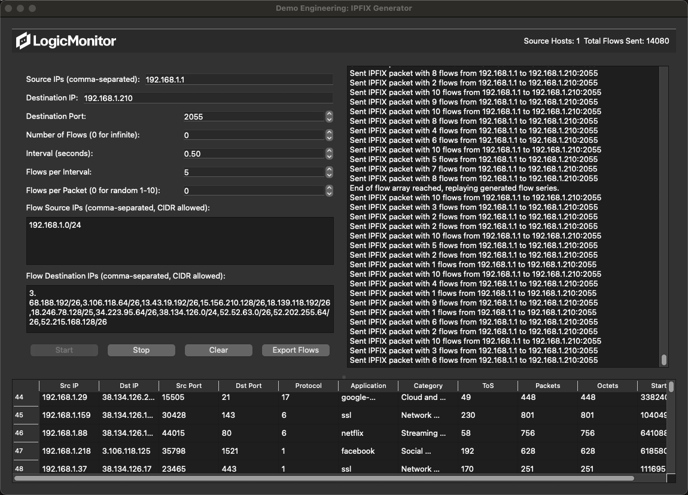

# IPFIX Generator

## Overview

The IPFIX Generator is a powerful tool designed to generate and send IPFIX (IP Flow Information Export) traffic for testing and demonstration purposes. It provides both a command-line interface and a graphical user interface (GUI) for easy operation.

## Features

- Generate IPFIX traffic with customizable parameters
- Support for multiple source IP addresses
- Configurable destination IP and port
- Adjustable flow generation rate and interval
- GUI for easy operation and real-time flow visualization
- Command-line interface for scripting and automation
- Export generated flows to CSV for further analysis

## UI Screenshot



This image shows the main interface of the IPFIX Generator, including the parameter input fields, control buttons, log output, and flow visualization table.

## Installation

### Prerequisites

- Python 3.6 or higher
- pip (Python package installer)

### Dependencies

You can install the required dependencies using the provided `requirements.txt` file:

```bash
pip install -r requirements.txt
```

This will install all necessary packages, including:

- PyQt5==5.15.11
- PyQt5_sip==12.15.0
- scapy==2.5.0

Alternatively, if you prefer to install packages manually, you can use:

```bash
pip install PyQt5 scapy
```

## Usage

### Graphical User Interface (GUI)

To launch the IPFIX Generator with the GUI:

```bash
sudo python lm-netflow-gen-v3.py --gui
```

The GUI provides an intuitive interface for setting parameters, starting/stopping traffic generation, and viewing generated flows.

### Command-Line Interface (CLI)

For command-line usage:

```bash
sudo python lm-netflow-gen-v3.py [options]
```

#### Options:

- `--source`: Comma-separated list of source IP addresses to spoof
- `--destination`: Destination IP address
- `--port`: Destination port (default: 2055)
- `--flows`: Number of flows to generate (0 for infinite)
- `--interval`: Interval between flow generations in seconds
- `--packets-per-interval`: Number of packets to send in each interval
- `--flows-per-packet`: Number of flows per packet (0 for random 1-10)
- `--flow-src-ips`: Comma-separated list of source IP addresses or CIDR ranges for flows
- `--flow-dst-ips`: Comma-separated list of destination IP addresses or CIDR ranges for flows

#### Example:

```bash
sudo python lm-netflow-gen-v3.py --source 192.168.1.1,192.168.1.2 --destination 10.0.0.1 --port 2055 --flows 1000 --interval 1 --packets-per-interval 5 --flows-per-packet 2 --flow-src-ips 192.168.0.0/24 --flow-dst-ips 10.0.0.0/24
```

## GUI Features

- Real-time log output
- Flow visualization table
- Export generated flows to CSV
- Start, stop, and clear functionalities
- Easy parameter configuration

## Notes

- This tool is intended for testing and demonstration purposes only.
- Ensure you have the necessary permissions to send traffic on your network.
- Use responsibly and in compliance with your network policies.

## License

This project is licensed under the MIT License - see the [LICENSE](LICENSE) file for details.

## Contributing

Contributions are welcome! Please feel free to submit a Pull Request.

## Support

For support, please open an issue in the GitHub repository.
<