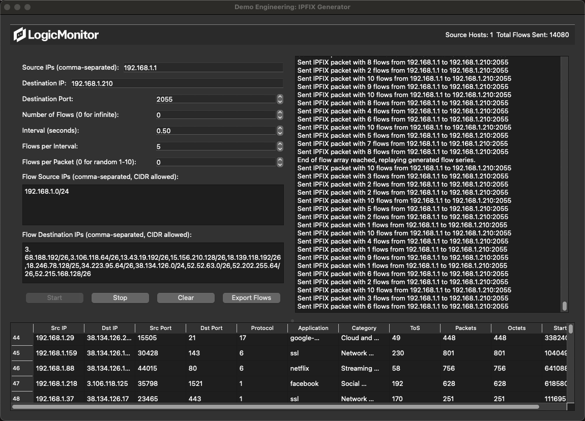

# IPFIX Generator

## Overview

The IPFIX Generator is a powerful tool designed to generate and send IPFIX (IP Flow Information Export) traffic for testing and demonstration purposes. It provides both a command-line interface and a graphical user interface (GUI) for easy operation.

## Features

- Generate IPFIX traffic with customizable parameters
- **Realistic traffic simulation** with authentic network patterns
  - Traffic profiles for web (HTTP/HTTPS), database, email, remote access, and more
  - Persistent sessions that simulate recurring connections
  - Weighted distribution matching real-world traffic patterns (50% web, 20% infrastructure, etc.)
  - Protocol-specific packet sizes and flow durations
  - Realistic byte counts and traffic volumes per service type
- Support for multiple source IP addresses
- Configurable destination IP and port
- Adjustable flow generation rate and interval
- GUI for easy operation and real-time flow visualization
- Command-line interface for scripting and automation
- Export generated flows to CSV for further analysis
- Real-time progress indicators and status updates

## UI Screenshot



This image shows the main interface of the IPFIX Generator, including the parameter input fields, control buttons, log output, and flow visualization table.

## Installation

### Prerequisites

- Python 3.6 or higher
- pip (Python package installer)

### Dependencies

You can install the required dependencies using the provided `requirements.txt` file:

```bash
pip install -r requirements.txt
```

This will install all necessary packages, including:

- PyQt5==5.15.11
- PyQt5_sip==12.15.0
- scapy==2.5.0

Alternatively, if you prefer to install packages manually, you can use:

```bash
pip install PyQt5 scapy
```

## Usage

### Graphical User Interface (GUI)

To launch the IPFIX Generator with the GUI:

```bash
python lm-netflow-gen-v3.py --gui
```

The GUI provides an intuitive interface for setting parameters, starting/stopping traffic generation, and viewing generated flows.

### Command-Line Interface (CLI)

For command-line usage:

```bash
python lm-netflow-gen-v3.py [options]
```

#### Options:

- `--source`: Comma-separated list of source IP addresses to spoof
- `--destination`: Destination IP address
- `--port`: Destination port (default: 2055)
- `--flows`: Number of flows to generate (0 for infinite)
- `--interval`: Interval between flow generations in seconds
- `--packets-per-interval`: Number of packets to send in each interval
- `--flows-per-packet`: Number of flows per packet (0 for random 1-10)
- `--flow-src-ips`: Comma-separated list of source IP addresses or CIDR ranges for flows
- `--flow-dst-ips`: Comma-separated list of destination IP addresses or CIDR ranges for flows

#### Example:

```bash
python lm-netflow-gen-v3.py --source 192.168.1.1,192.168.1.2 --destination 10.0.0.1 --port 2055 --flows 1000 --interval 1 --packets-per-interval 5 --flows-per-packet 2 --flow-src-ips 192.168.0.0/24 --flow-dst-ips 10.0.0.0/24
```

This command will:
- Generate flows from 192.168.0.0/24 to 10.0.0.0/24 address ranges
- Send IPFIX packets from source IPs 192.168.1.1 and 192.168.1.2
- Send to collector at 10.0.0.1:2055
- Generate 1000 flows total
- Send 5 packets per second with 2 flows per packet
- Use realistic traffic patterns (web, database, email, etc.)

## GUI Features

- Real-time log output
- Flow visualization table
- Export generated flows to CSV
- Start, stop, and clear functionalities
- Easy parameter configuration

## Realistic Traffic Simulation

The IPFIX Generator creates authentic-looking network flows that closely mirror real-world traffic patterns. This is essential for:

- **Testing NetFlow/IPFIX collectors** with realistic data volumes and patterns
- **Validating visualization dashboards** with traffic that looks like production networks
- **Training and demonstrations** using flows that accurately represent enterprise networks

### Traffic Profiles

The generator includes weighted traffic profiles matching typical enterprise networks:

| Profile | Weight | Services | Characteristics |
|---------|--------|----------|----------------|
| **Web Traffic** | 50% | HTTP (80), HTTPS (443), Alt ports (8080, 8443) | Variable sizes, 10-500 packets, 200-1500 bytes/packet |
| **Infrastructure** | 20% | DNS (53), NTP (123), Syslog (514) | Small, quick queries, 1-20 packets |
| **Database** | 10% | MySQL (3306), PostgreSQL (5432), MS SQL (1433), Oracle (1521) | Medium queries, 5-100 packets |
| **Email** | 8% | SMTP (25, 587), IMAP (143, 993), POP3 (110, 995) | Varied sizes, 3-100 packets |
| **Remote Access** | 7% | SSH (22), RDP (3389) | Interactive sessions, longer durations |
| **Other Services** | 5% | LDAP (389, 636), SIP (5060), SNMP (161) | Protocol-specific patterns |

### Session Persistence

20% of flows are from **persistent sessions** - repeated connections between the same source/destination pairs. This simulates:
- Users accessing the same web servers repeatedly
- Database connections from application servers
- Ongoing SSH/RDP sessions
- Regular email checks

### Realistic Metrics

- **Packet counts** vary by service type (DNS: 1-5 packets, Web: 10-500 packets, File transfers: 100-5000 packets)
- **Byte counts** use authentic size distributions with per-packet variation
- **Flow durations** match expected service timings (DNS: <500ms, Web: 100ms-30s, SSH: 1s-5min)
- **Interface IDs** concentrate on 1-10 interfaces (realistic for most networks)
- **ToS values** primarily use common values (mostly 0, some 16, 32, 40)

## Notes

- This tool is intended for testing and demonstration purposes only.
- Ensure you have the necessary permissions to send traffic on your network.
- Use responsibly and in compliance with your network policies.

## License

This project is licensed under the MIT License - see the [LICENSE](LICENSE) file for details.

## Contributing

Contributions are welcome! Please feel free to submit a Pull Request.

## Support

For support, please open an issue in the GitHub repository.
<